## Green Space and Air Quality

### Overview

This project analyzes the relationship between the amount of green space and air quality for different counties in California  by analyzing air quality data and calculating the percentage of green space per county. Air quality data is obtained from the Environmental Protection Agency (EPA) online portal, downloading AQI by County files for the years 1990, 1995, …, 2020. Air quality data is anlyzed and mapped in terms of the *Total Unhealthy Days* per year, per county. The percent of green space for California counties is calculated using green space data queried from openstreetmap (OSM).

### Key Findings:
- Northern California counties have significantly better air quality than Southern California counties with much lesser number of Total Unhealthy Days per year.
- The California counties with the historically worst air quality are the neighboring counties of Riverside, San Bernardino, Los Angeles, and Kern. 
- Air quality data indicates a small improvement in air quality in 2020 compared to 1990 in California.
- Geographically, northern California has more green space than Southern California, however OSM queries fail to obtain significant amounts of green space data for Northern California counties.

## Table of Contents
1. [Project Description](#project-description)
2. [Data](#data)
3. [Analysis](#analysis)

## Project Description

We first analyze temporal and spatial trends in air quality data. We calculate and plot state-wide averages over time as well as temporal averages per county. We then investigate the best and worst counties in terms of **"Total Unhealthy Days"** of air quality per year. We also provide geographical context by mapping this number per California county. This variable is introduced in this study and defined as the sum of all unhealthy day variables recorded in EPA’s AQI by County files. We also obtain green space data from OSM to calculate the percent of green space in the 2020 worst and best air quality California counties. For more details go to the Analysis section.

### Goals:
- Investigate trends in air quality data at the county level in California from 1990 to 2020.
- Explore relationship between amount of green space and air quality per county.
- Produce insights into the benefits of green spaces in urban planning and environmental policy.

## Data
- **Air quality data**. EPA Annual Summary AQI by County csv files for the years 1990, 1995, …, 2020 can be found in the EPA_Data folder. Data includes number of healthy or unhealthy air quality days per year for each county. Also included in this folder is the jupyter notebook to perform EDA and produce charts and maps.
- **Geospatial data**. geojson files for California county boundary data as well as the jupyter notebook to produce CA counties map can be found in the CA_countyBndries folder. The OSM_Data folder includes the jupyter notebook to query green space data from OSM; geojson files not included due to large file sizes.

## Analysis
After filtering and cleaning California air quality data, we plot a time series of the state-wide averages in the number of Good Days, Moderate Days and Total Unhealthy Days.   

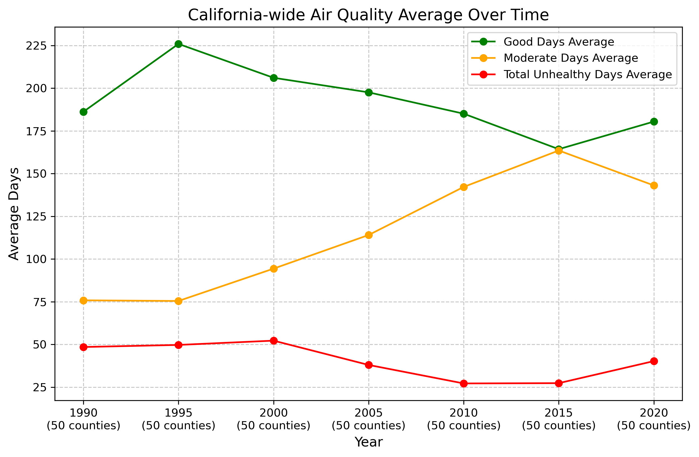  

This plot reveals some improvement in California average air quality over the years since we observe a higher average number of Moderate Days and a slightly lower average number of Total Unhealthy Days in the year 2020 compared to 1990. Even though the average number of Good Days is slightly lower in the year 2020 compared to 1990.

Next we plot the temporal average number of Total Unhealthy days per county for the time span of 1990 – 2020.    

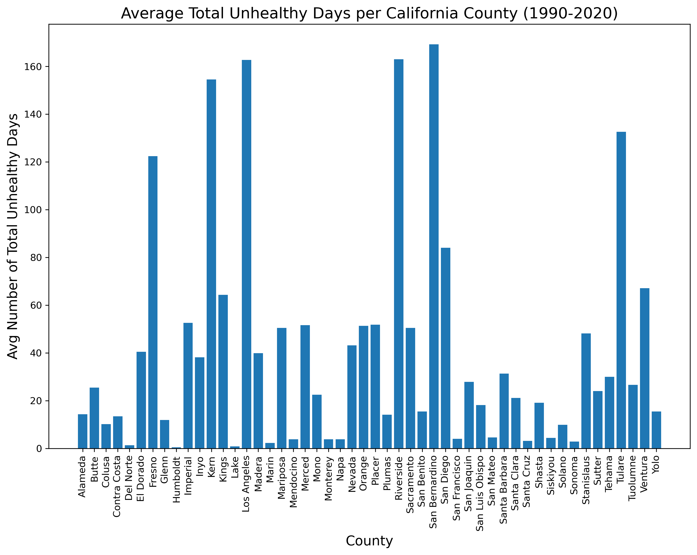 

Here we observe that Kern, Los Angeles, Riverside and San Bernardino have the highest number of Total Unhealthy Days per year in air quality, with Tulare and Fresno close behind.    

In what follows we identify the best and worst air quality counties in each dataset. That is, we select the top 5 counties with the highest number of  **Total Unhealthy Days** and the top 5 counties with the highest number of **Good Days** for each year of air quality data.
    
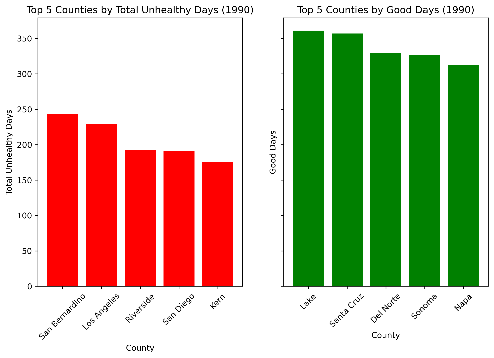
   
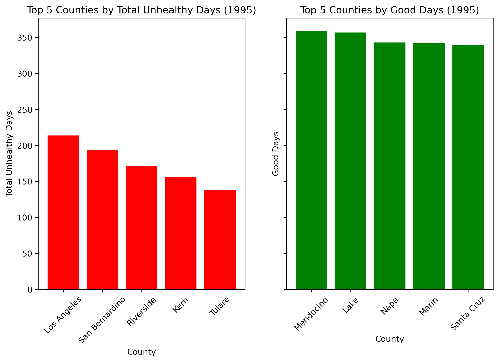
   
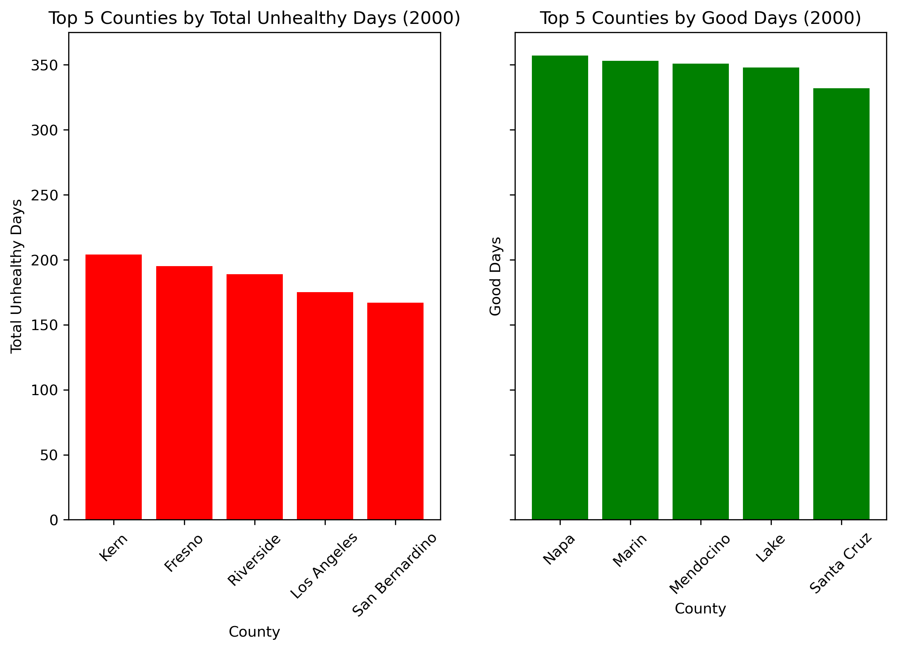 
   
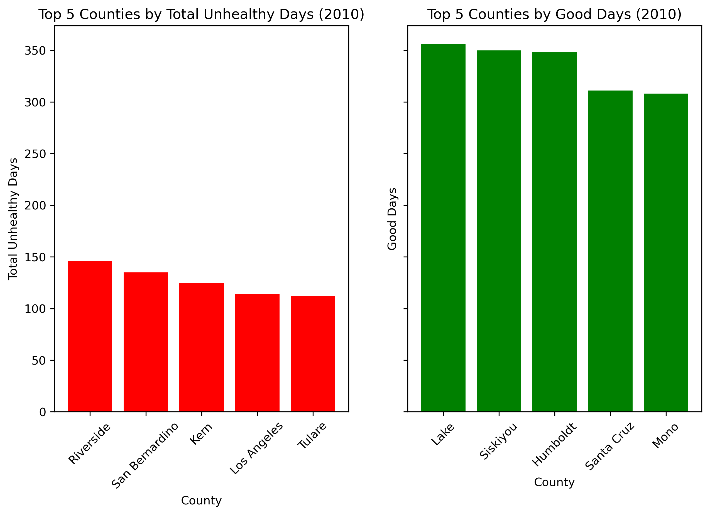
   
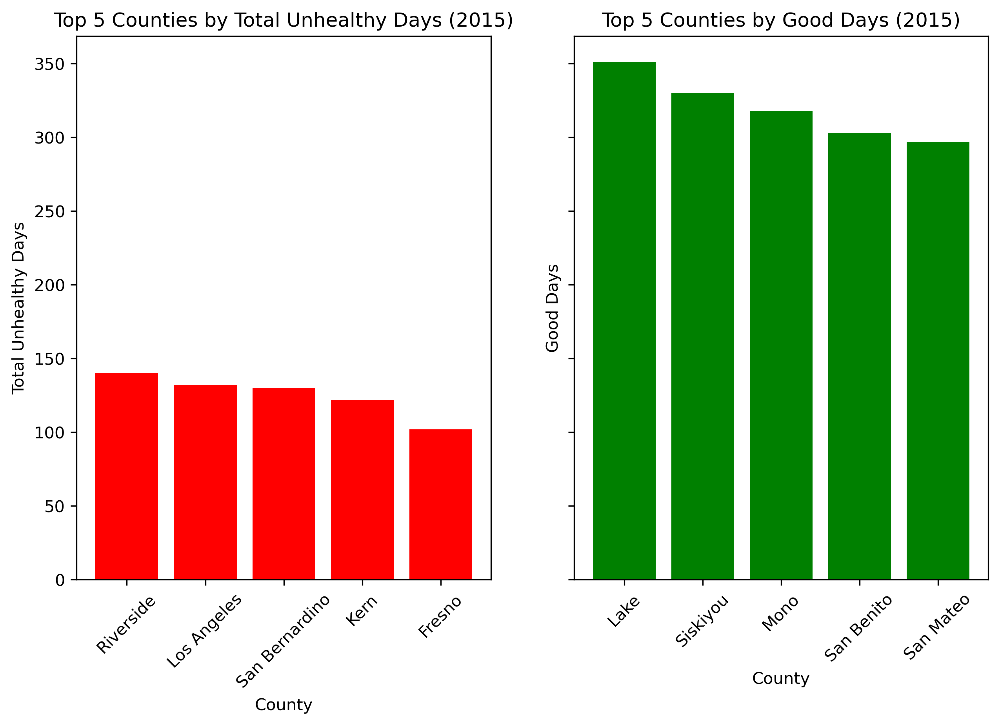   
   
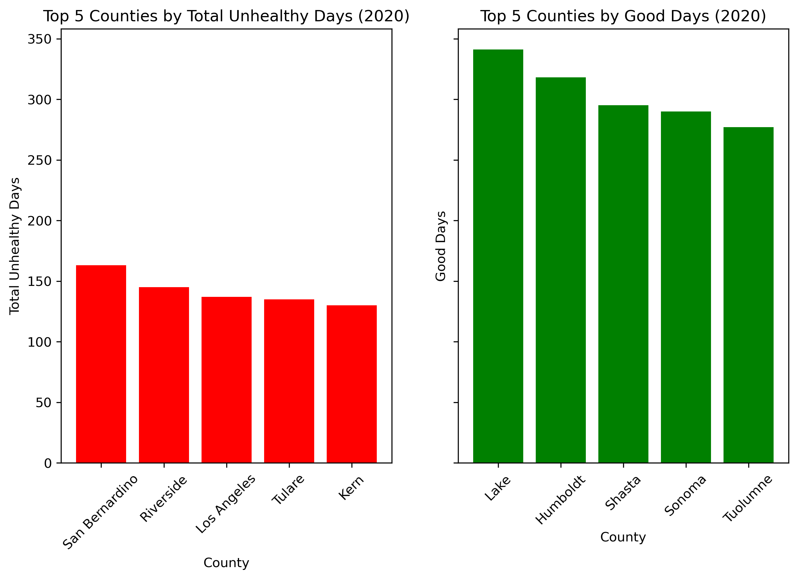   

Here we discover very little variation in the counties that make it to the top 5 by Total Unhealthy Days. Making every list are the neighboring  Southern California counties of Kern, Los Angeles, Riverside and San Bernardino. With Tulare and Fresno also making regular appearances. San Diego county makes the list of top 5 by Total Unhealthy Days only in 1990. Is it possible that San Diego county has since adopted green-space-promoting initiatives? What was the percent of green space in 1990?    
On the other hand, we also discover that most counties making the top 5 by Good Days lists are located in Northern California with Lake county making the top 5 in each data set. We also notice more variation in the counties making the top 5 by Good Days. Some central counties making the top 5 are Santa Cruz and San Benito.   

In the next figures we map the number of **Total Unhealthy Days** per year for each California county. This illustrates the variation in air quality across different counties and provides geographical context. We produce maps for the year 1990, 2000, 2010, and 2020.
  
#### 1990
   

#### 2000
 

#### 2010
  

#### 2020
   

Next, we’d like to obtain information about the percent of green space in each county. Although this may sound simple, the process requires downloading large amounts of geographical data. Thus we first focus on the 2020, five best and worst air quality counties in California. We query from OSM for green space data in terms of parks, forests, national parks, protected areas, etc. Query code can be found in the OSM_Data folder. We mention that green space data from OSM is current; to compare to green space in 1990, we'll likely need satellite raster data.

Once green space data for the 2020 best and worst counties is obtained and formatted (remove duplicates and take unary union) we map and layer with the California county boundaries. 
    
#### 2020 Best Counties Green Space Map
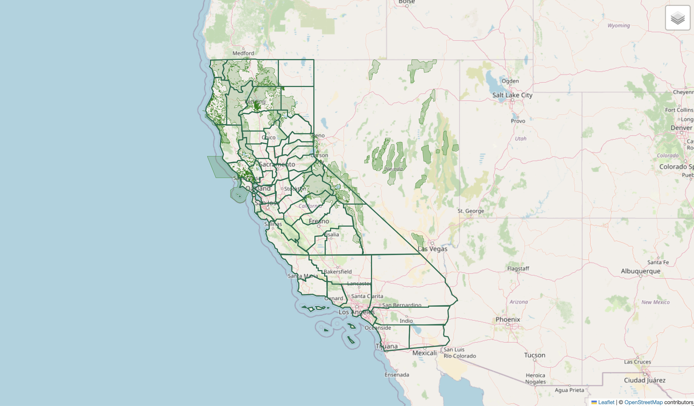 
    
#### 2020 Worst Counties Green Space Map
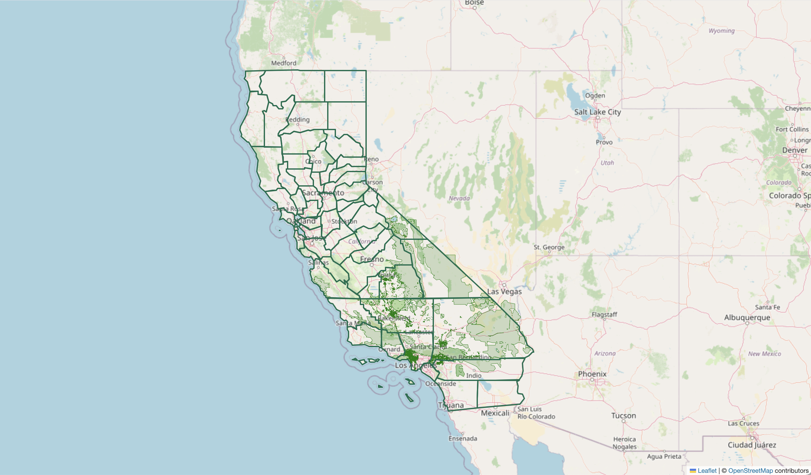 

To compute green space percentages in the 2020 best and worst counties, we merge green space data and county boundary data by intersection an calculate by (sum of green space geometries' area)/(county boundary area) * 100. And we map the results.   
    
#### 2020 Best Counties Percent Green Space 
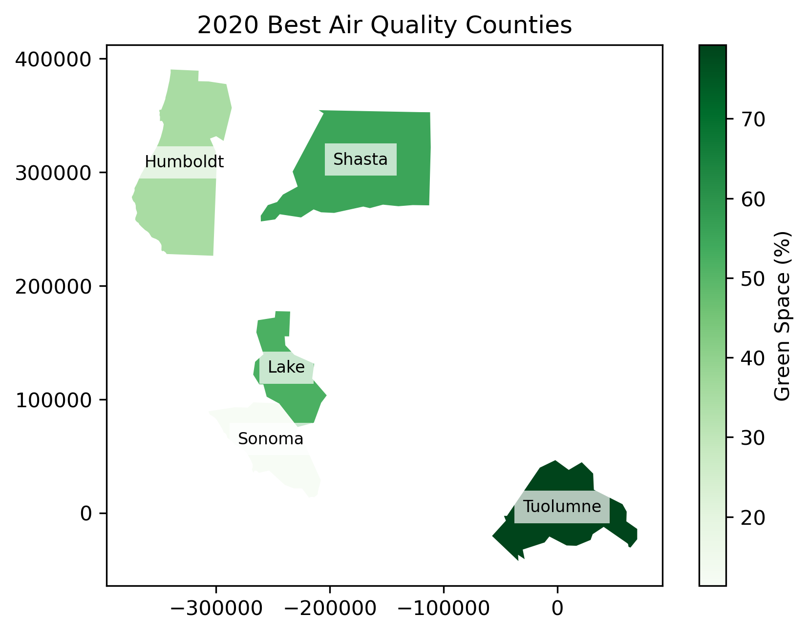    
    
#### 2020 Worst Counties Percent Green Space 
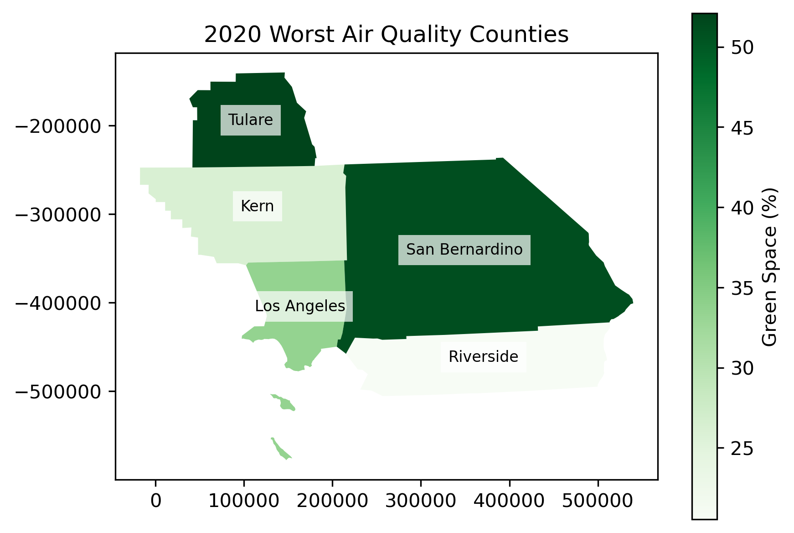  

An interesting observation is that some of the 2020 best counties in air quality have a surprisingly low percentage of green space. A closer examination of the green space .html maps reveals significant gaps in the data, particularly in Sonoma and Humboldt counties which, given their geography and extensive forested areas, we would expect to have a much higher percentage of green space, suggesting that the data set may be incomplete.

We also notice that the counties of Tulare and San Bernardino(in the 2020 worst counties category) has high percentage of green space, however this county makes the top 5 for worst air quality in four of the data sets. An internet search reveals that Tulare's extensive agricultural operations and industrial emissions largely contribute to air pollution. These effects are amplified by the topography and geographic location as Tulare is located in the San Joaquin Valley and surrounded by mountains, preventing the dispersion of pollutants. San Bernardino is known for high level of industrial activity. The amount of green space in these counties is insufficient to counteract air pollution.

These findings highlight the complex relationship between green space and air quality. Air quality data consistently shows that northern California counties rank among the top five best air quality, with fewer Total Unhealthy Days per year in all datasets used here. And while data limitations may obscure the true extent of green space coverage in some of these counties, it is well established that northern California has greater amount of green space compared to Southern California. This pattern is reinforced by the fact that southern California counties consistently rank among the worst in air quality, experiencing significantly more Total Unhealthy Days per year.

Overall, this analysis underscores the potential role of green space in air quality outcomes. However, further analyses would benefit from incorporating influence of geographic, industrial and climatic factors, as well as from obtaining more comprehensive datasets. This would provide deeper insights into the extent to which green infrastructure can help mitigate pollution and improve air quality.
