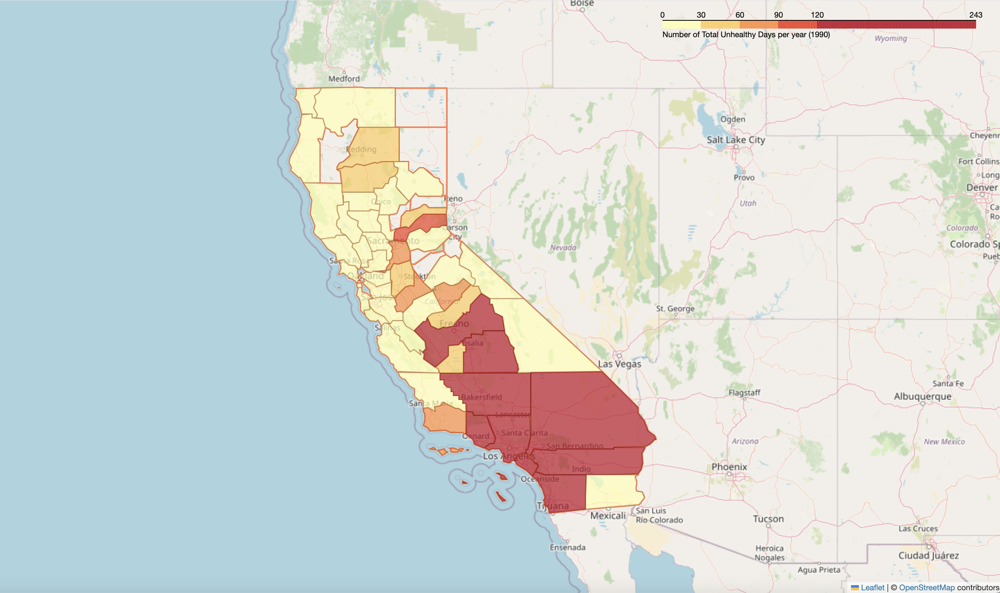
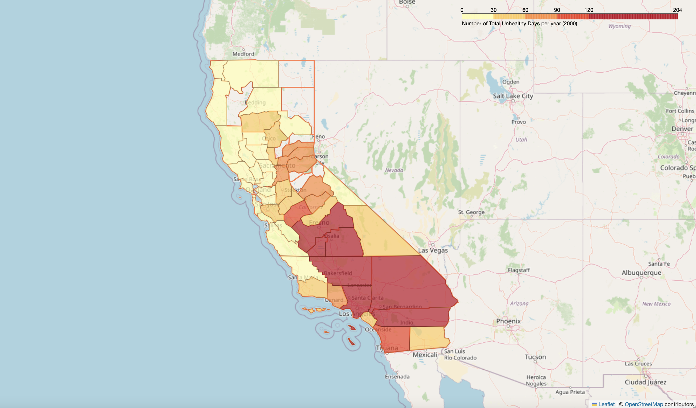
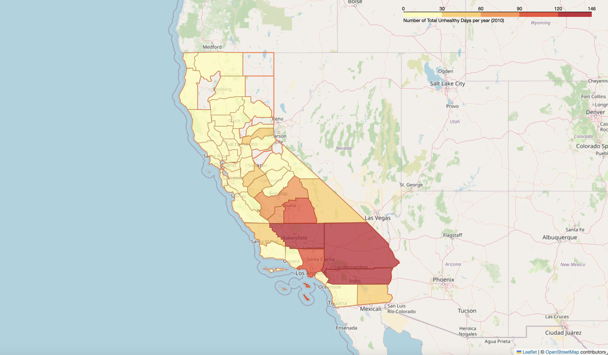
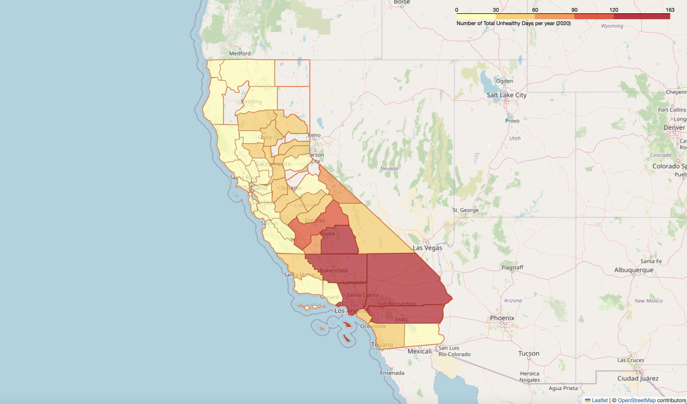

## Green Space and Air Quality

### Overview

This project analyzes the relationship between the amount of green space and air quality for  different counties in California  by analyzing air quality data and calculating the percentage of green space per county. Air quality data is obtained from the Environmental Protection Agency (EPA) online portal, downloading AQI by County files for the years 1990, 1995, …, 2020. Air quality data is anlyzed and mapped in terms of the *Total Unhealthy Days* per year, per county. The percent of green space for California counties is calculated using green space data queried from openstreetmap (OSM).

### Key Findings:
- Northern California counties have significantly better air quality than Southern California counties with much lesser number of Total Unhealthy Days per year.
- The California counties with the historically worst air quality are the neighboring counties of Riverside, San Bernardino, Los Angeles, and Kern. 
- Air quality data indicates a small improvement in air quality in 2020 compared to 1990 in California.
- Geographically, northern California has more green space than Southern California, however OSM queries fail to obtain significant amounts of green space data for Northern California counties.

## Table of Contents
1. [Project Description](#project-description)
2. [Data](#data)
3. [Analysis](#analysis)

## Project Description

We first analyze temporal and spatial trends in air quality data. We calculate and plot state-wide averages over time as well as temporal averages per county. We then investigate the best and worst counties in terms of **"Total Unhealthy Days"** of air quality per year. We also provide geographical context by mapping this number per California county. This variable is introduced in this study and defined as the sum of all unhealthy day variables recorded in EPA’s AQI by County files. We also obtain green space data from OSM to calculate the percent of green space in the 2020 worst and best air quality California counties. For more details go to the Analysis section.

### Goals:
- Investigate trends in air quality data at the county level in California from 1990 to 2020.
- Explore relationship between amount of green space and air quality per county.
- Produce insights into the benefits of green spaces in urban planning and environmental policy.

## Data
The following data files can be found in the data folder:
- **Air quality data**. EPA Annual Summary AQI by County csv files for the years 1990, 1995, …, 2020. Includes information on the number of healthy or unhealthy air quality days per year for each county.
- **Geospatial data**. geojson files for California county boundary data.

## Analysis
After filtering California air quality data, we plot a time series of the state-wide averages in the number of Good Days, Moderate Days and Total Unhealthy Days.   

  

This plot reveals a small improvement in air quality over the years since the California air quality has a higher average number of Good Days and a lower average number of Total Unhealthy Days in 2020 than in 1990. However, the 2020 average number of Moderate Days has increased significantly wince 1990. It would be interesting to investigate if the EPA’s criteria for what constitutes a good, moderate, or unhealthy day has changed significantly over the years since 1990.    

Next we plot the temporal average number of Total Unhealthy days per county for the time span of 1990 – 2020.    

 

Here we observe that Kern, Los Angeles, Riverside and San Bernardino have the historic highest number of Total Unhealthy days in air quality, with Tulare and Fresno close behind.    

In what follows we identify the best and worst air quality counties in each dataset. That is, we select the top 5 counties with the highest number of  **Total Unhealthy Days** and the top 5 counties with the highest number of **Good Days** for each year of air quality data.
    

   

   
 
   

   
   
   
   

Here we discover very little variation in the counties that make it to the top 5 by Total Unhealthy Days. Making every list are the neighboring  Southern California counties of Kern, Los Angeles, Riverside and San Bernardino. With Tulare and Fresno also making regular appearances. San Diego county makes the list of top 5 by Total Unhealthy Days only in 1990. Is it possible that San Diego county has since adopted green-space-promoting initiatives? What was the percent of green space in 1990?    
On the other hand, we also discover that most counties making the top 5 by Good Days lists are located in Northern California with Lake county making the top 5 in each data set. We also notice more variation in the counties making the top 5 by Good Days lists. Some central counties making some top 5 lists are Santa Cruz and San Benito.   

In the next figures we map the number of **Total Unhealthy Days** per year for each California county. This illustrates the variation in air quality across different counties and provides geographical context. We produce maps for the year 1990, 2000, 2010, and 2020.
  
#### 1990
   

#### 2000
 

#### 2010
  

#### 2020
   

Next, we’d like to obtain information about the percent of green space in each county. Although this may sound simple, the process requires downloading large amounts of geographical data. Thus we first focus on the 2020 top 5 counties by Total Unhealthy Days. We query for green space data in terms of parks, forests, national parks, protected areas, etc. from OSM for the counties of San Bernardino, Riverside, Los Angeles, Tulare and Kern.    
We mention that data from OSM is current; historical green space data e.g. from 1990 may be difficult to obtain and compare with current data.   

Once green space geographical data is obtained, we map and layer with the California county boundaries. 
  

From this map we see that queried green space data spans further than each county’s boundary, thus we merge green space data and county boundary data by intersection. We also notice that the county of Kern has some visible green spaces north of Bakersfield that were not retrieved in our OSM query. Similarly, the most western part of Riverside county seems to have green space missed by our query. For now we proceed as is, and we calculate the percent of green space by dividing the amount of green space area in each county by the total county area. 

   

Here we see that the county of Tulare has high percentage of green space, however this county makes the top 5 for worst air quality in four of the data sets. An internet search reveals that Tulare's extensive agricultural operations and industrial emissions largely contribute to air pollution. These effects are amplified by the topography and geographic location as Tulare is located in the San Joaquin Valley and surrounded by mountains, preventing the dispersion of pollutants. The amount of green space in this county is insufficient to counteract air pollution.

Some threads to follow here:   
We still have not shown that more green space correlates with better air quality. One way to do this may be to query green space data for ALL of California and this may be a massive file. 
If such data can be obtained, we can then calculate percent green space and compare with number of good days, or total unhealthy days. That is perform a correlation analysis e.g. scatterplot or linear regression (since only two variables).   
   
Furthermore, due to our last point about Tulare county having high percent of green space but low air quality, what can we say about the importance of other variables affecting air quality, such as agricultural or industrial activity?

